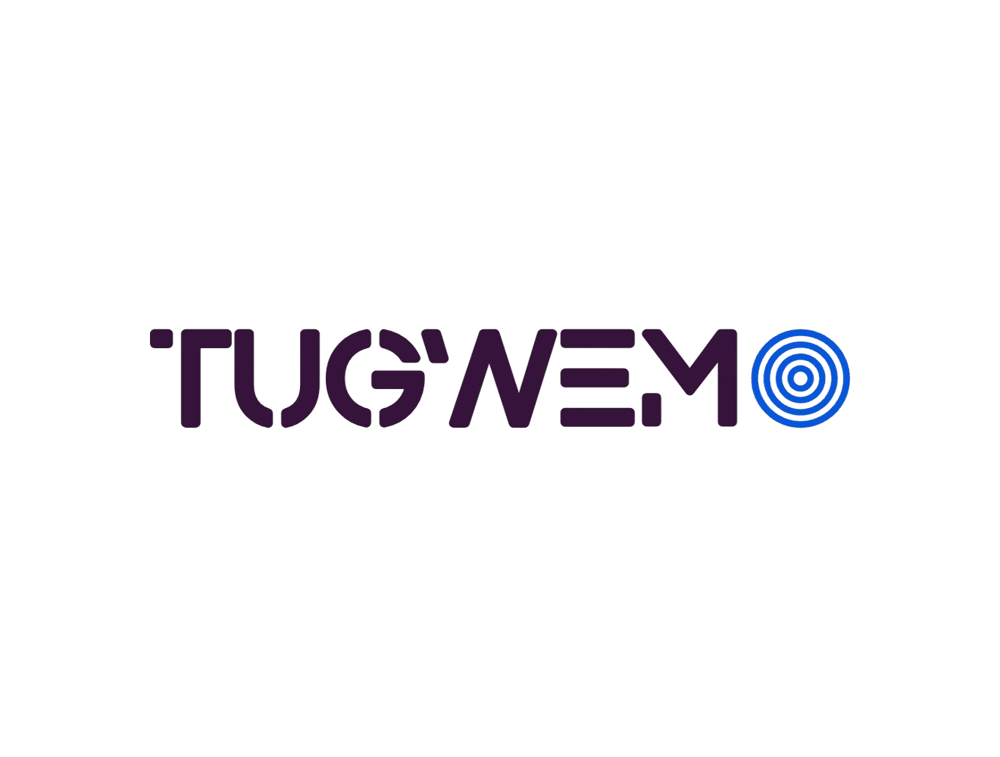

# Tugwemo - Anonymous Video Chat Platform



Tugwemo is Rwanda's premier platform for anonymous video chat and meaningful connections. Built with modern web technologies, it provides a safe, inclusive space for people to meet, share stories, and build lasting relationships through anonymous video chatting.

## 🌟 Features

### Core Features
- **Anonymous Video Chat**: Connect face-to-face with random people or skip to the next conversation
- **Rich Text Chat**: Chat alongside video calls with emojis, GIFs, stickers, and cultural expressions
- **Enterprise Security**: Bank-level encryption, AI-powered moderation, and instant reporting tools
- **Multilingual Support**: Chat in Kinyarwanda, French, English, or Swahili
- **Smart Matching**: Advanced algorithms connect users based on interests, location, and preferences
- **Cultural Connection**: Rwanda-specific features celebrating rich cultural heritage

### Technical Features
- **Real-time Communication**: WebRTC-powered peer-to-peer video and audio
- **Responsive Design**: Fully responsive across desktop, tablet, and mobile devices
- **Admin Dashboard**: Comprehensive admin panel for platform management
- **User Management**: Advanced user analytics and moderation tools
- **Reporting System**: Built-in reporting and analytics capabilities

## 🏗️ Architecture

### Project Structure
```
tugwemo/
├── client/                 # Frontend client application
│   ├── index.html         # Landing page
│   ├── video.html         # Video chat interface
│   ├── style.css          # Main stylesheets
│   ├── videostyle.css     # Video page styles
│   ├── index.js           # Client-side JavaScript
│   └── public/            # Static assets
├── server/                # Backend server
│   ├── src/
│   │   ├── index.ts       # Main server file
│   │   ├── lib.ts         # Core logic
│   │   ├── types.ts       # TypeScript types
│   │   ├── models/        # MongoDB models
│   │   ├── controllers/   # Route controllers
│   │   ├── routes/        # API routes
│   │   ├── middlewares/   # Express middlewares
│   │   ├── socket/        # Socket.io handlers
│   │   └── scripts/       # Utility scripts
│   ├── package.json
│   └── tsconfig.json
└── admin/                 # Admin dashboard (React)
    ├── src/
    │   ├── components/    # Reusable components
    │   ├── pages/         # Admin pages
    │   ├── contexts/      # React contexts
    │   ├── App.jsx        # Main app component
    │   └── main.jsx       # Entry point
    ├── package.json
    ├── vite.config.js
    ├── tailwind.config.js
    └── postcss.config.js
```

### Technology Stack

#### Frontend (Client)
- **HTML5/CSS3**: Modern responsive design
- **Vanilla JavaScript**: ES6+ modules for client-side logic
- **WebRTC**: Real-time peer-to-peer communication
- **Socket.io Client**: Real-time bidirectional communication

#### Backend (Server)
- **Node.js**: Runtime environment
- **Express.js**: Web application framework
- **TypeScript**: Type-safe JavaScript
- **Socket.io**: Real-time bidirectional communication
- **MongoDB**: NoSQL database with Mongoose ODM
- **JWT**: Authentication and authorization
- **bcryptjs**: Password hashing
- **CORS**: Cross-origin resource sharing

#### Admin Dashboard
- **React**: UI library
- **Vite**: Build tool and development server
- **Tailwind CSS**: Utility-first CSS framework
- **React Router**: Client-side routing
- **Axios**: HTTP client
- **Recharts**: Data visualization
- **Radix UI**: Accessible UI components

## 🚀 Getting Started

### Prerequisites
- Node.js (v16 or higher)
- npm or yarn
- MongoDB (local or cloud instance)
- Git

### Installation

1. **Clone the repository**
   ```bash
   git clone https://github.com/yourusername/tugwemo.git
   cd tugwemo
   ```

2. **Install server dependencies**
   ```bash
   cd server
   npm install
   ```

3. **Install admin dashboard dependencies**
   ```bash
   cd ../admin
   npm install
   ```

4. **Set up environment variables**

   Create a `.env` file in the `server` directory:
   ```env
   PORT=8000
   MONGODB_URI=mongodb://localhost:27017/tugwemo
   JWT_SECRET=your-super-secret-jwt-key
   ADMIN_EMAIL=#
   ADMIN_PASSWORD=#
   ```

5. **Seed admin user**
   ```bash
   cd server
   npm run seed-admin
   ```

### Running the Application

1. **Start the server**
   ```bash
   cd server
   npm start
   ```
   Server will run on `http://localhost:8000`

2. **Start the admin dashboard** (in a new terminal)
   ```bash
   cd admin
   npm run dev
   ```
   Admin dashboard will run on `http://localhost:5173`

3. **Access the application**
   - **Client**: Open `http://localhost:8000` in your browser
   - **Admin Dashboard**: Open `http://localhost:5173` and login with admin credentials

## 📱 Usage

### For Users
1. Visit the landing page
2. Click "Get Started Free" or "Tangira"
3. Allow camera and microphone permissions
4. Start chatting anonymously with random users
5. Use the chat feature alongside video calls
6. Click "Next" to connect with someone new or "Stop" to end the session

### For Administrators
1. Access the admin dashboard at `http://localhost:5173`
2. Login with admin credentials
3. Monitor user activity, reports, and analytics
4. Manage users, ads, and platform settings
5. View logs and system statistics

## 🔧 API Documentation

### Authentication Endpoints
- `POST /api/auth/login` - Admin login
- `POST /api/auth/logout` - Admin logout

### Admin Endpoints
- `GET /api/admin/dashboard` - Dashboard statistics
- `GET /api/admin/users` - User management
- `GET /api/admin/reports` - Reports management
- `GET /api/admin/analytics` - Analytics data
- `GET /api/admin/ads` - Advertisement management
- `GET /api/admin/settings` - Platform settings
- `GET /api/admin/logs` - System logs

### Socket Events
- `start` - Initialize video chat session
- `next` - Connect to next user
- `disconnect` - End current session
- `send-message` - Send chat message
- `ice:send` - WebRTC ICE candidate exchange
- `sdp:send` - WebRTC SDP exchange

## 🛡️ Security Features

- **End-to-end Encryption**: WebRTC provides encrypted peer-to-peer communication
- **User Anonymity**: No personal information required to use the platform
- **Content Moderation**: AI-powered moderation system
- **Reporting System**: Users can report inappropriate behavior
- **Admin Oversight**: Comprehensive admin tools for monitoring and moderation
- **Rate Limiting**: Prevents abuse and spam
- **Input Validation**: Server-side validation for all user inputs

## 🌐 Browser Support

- Chrome (recommended)
- Firefox
- Safari
- Edge
- Mobile browsers (iOS Safari, Chrome Mobile)

## 🤝 Contributing

1. Fork the repository
2. Create a feature branch (`git checkout -b feature/amazing-feature`)
3. Commit your changes (`git commit -m 'Add amazing feature'`)
4. Push to the branch (`git push origin feature/amazing-feature`)
5. Open a Pull Request

## 📄 License

This project is licensed under the MIT License - see the [LICENSE](LICENSE) file for details.

## 🙏 Acknowledgments

- Built with IX in Rwanda
- Inspired by the spirit of "Tugwemo" - connecting people
- Thanks to the open-source community for amazing tools and libraries

## 📞 Contact

- **Website**: [tugwemo.com](https://tugwemo.com)
- **Email**: contact@tugwemo.com
- **Twitter**: [@tugwemo](https://twitter.com/tugwemo)
- **Facebook**: [Tugwemo Official](https://facebook.com/tugwemo)

---

**Made with IX in Rwanda for the world** 🇷🇼
